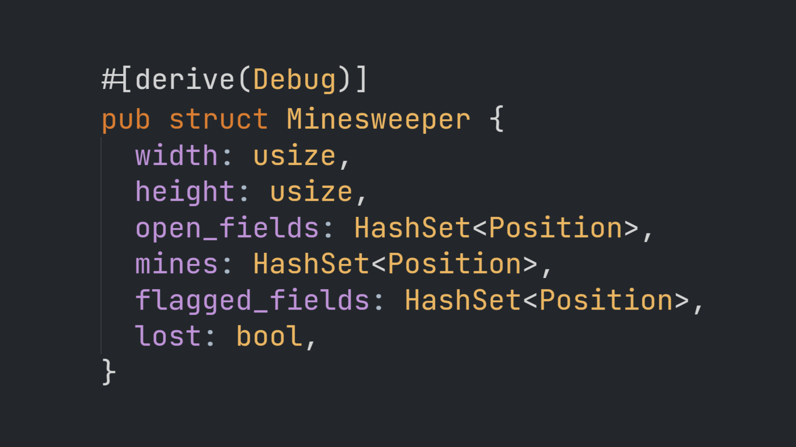

# Minesweeper

[][video]<br/>
[*Watch Video*][video]

## Building

Make sure you have [Rust](https://www.rust-lang.org) installed and [wasm-pack](https://rustwasm.github.io/wasm-pack/). To build this project, run:

```
$ wasm-pack build --target web
```

To run this project, you need a static file server. You can install `serve` with npm:

```
$ npm install serve -g
```

Now, start your static file server and open `index.html`:

```
$ serve
```

[video]: https://youtube.com
