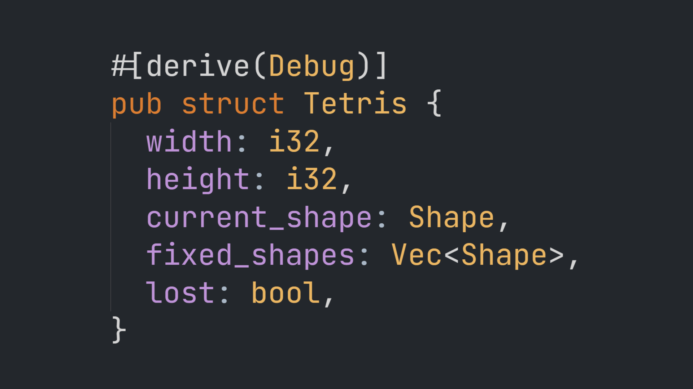

# Tetris

[][video]<br/> [_Watch
Video_][video]

[video]: https://www.youtube.com/watch?v=_lAr7JveRVE

## Building

Make sure you have [Rust](https://www.rust-lang.org) installed and
[wasm-pack](https://rustwasm.github.io/wasm-pack/). To build this project, run:

```
$ wasm-pack build --target web
```

To run this project, you need a static file server. You can install `sfz` with
cargo:

```
$ cargo install sfz
```

Now, start your static file server and open `index.html`:

```
$ sfz -r
```
